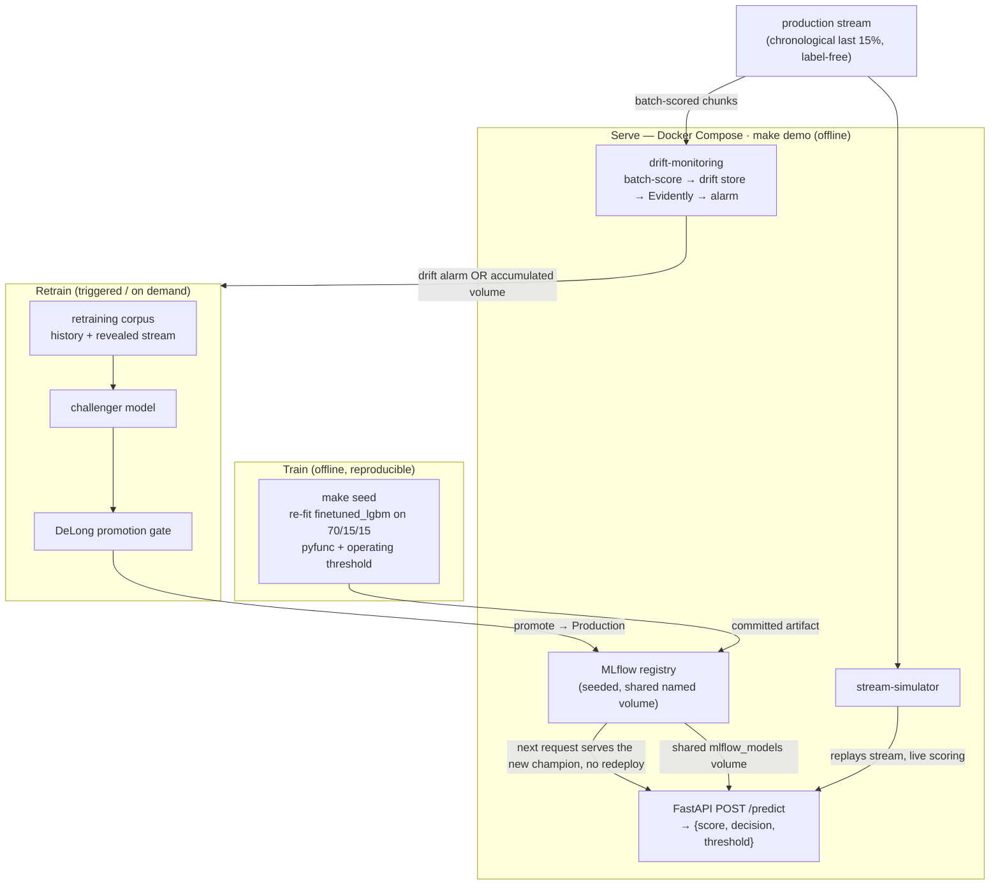

# IEEE-CIS Fraud Detection — an end-to-end MLOps deployment

A portfolio-grade MLOps project that takes a strong fraud-detection model and
runs the **full closed loop** around it: reproducible training → registry →
serving (real-time API + batch) → drift monitoring → triggered retraining with
a statistical promotion gate — all reproducible locally with Docker and wired
to GitHub Actions CI/CD.

The model is a fine-tuned LightGBM on the
[IEEE-CIS Fraud Detection](https://www.kaggle.com/competitions/ieee-fraud-detection)
dataset (~590k transactions, 218 features, extreme class imbalance, MNAR
missingness). One command — **`make demo`** — brings up the whole stack from a
committed seed artifact: no training, no cloud, no registry auth.

## Highlights

- **Reproducible seed model** — `make seed` re-fits the `finetuned_lgbm` recipe
  on a chronological 70/15/15 split (ADR-0003) and commits a self-contained
  MLflow `pyfunc` artifact (feature transform + booster + operating threshold).
  **Test AUC 0.9286**, operating threshold **0.0551** (10:1 cost ratio).
- **Strict feature contract** — the served model accepts exactly the 218
  training columns (9 categoricals as `category`); missing/extra/wrong-dtype/NaN
  payloads are rejected with a precise error (ticket 03).
- **Two serving surfaces, one model** — a FastAPI `POST /predict` returning
  `{score, decision, threshold}` and a batch CLI that scores CSVs and feeds the
  drift monitor (tickets 04–05).
- **Real monitoring** — an Evidently drift pass compares a recent scored window
  to the training reference and alarms on feature *or* score drift (ticket 08).
- **A real retraining loop** — a Prefect flow rebuilds the corpus (history +
  revealed stream, 7-day reveal lag), trains a challenger, and promotes it only
  when a **DeLong significance test** says it is genuinely better (ADR-0004).
  A promoted model is served with no redeploy (ticket 07).
- **Turnkey demo + real CI/CD** — `make demo` runs the whole stack offline from
  the committed seed (ticket 09); GitHub Actions runs lint/contract/tests and
  publishes the serving image to GHCR (ticket 10).

## Architecture



**Reading the loop:** the production stream (the chronological last 15% of the
data, label-free at serve time) feeds two paths. The stream simulator replays
it through the API for **live scoring**; the drift-monitoring pass
**batch-scores stream chunks** into the drift window and compares it to the
training reference. When enough features drift or the score distribution
shifts, monitoring raises an alarm. The retraining flow then folds the stream
(labels revealed after a 7-day lag) into a larger corpus, trains a challenger,
and — only if the DeLong test on the shared test set says it is significantly
better — promotes it to `Production`, which the API serves on the next request.

## Quickstart — `make demo`

Prerequisites: Python 3.12 + [uv](https://docs.astral.sh/uv/), Docker Desktop
(**≥ 12 GB memory**), the raw data via [DVC](https://dvc.org/) (`dvc pull`),
and the processed features (gitignored — built once by `features.py`).

```bash
uv sync                                            # install deps into .venv
dvc pull                                           # fetch the raw data (data/raw/*)
.venv/bin/python -m ieee_cis_fraud_detection.features  # build data/processed features
make demo                                          # bring up the stack from the committed seed
```

`make demo` pre-flights Docker, the processed features, and the committed seed,
then starts four services on one image and prints their URLs:

| Service | URL | What it runs |
|---------|-----|--------------|
| MLflow | http://localhost:5001 | registry seeded with champion v1 (no re-training) |
| Prefect | http://localhost:4200 | schedules the simulator + monitoring deployments |
| API | http://localhost:8000 | `POST /predict` → `{score, decision, threshold}` |
| Worker | — | runs the stream simulator + drift-monitoring passes |

```bash
make demo-logs      # watch live scoring + monitoring passes
make demo-down      # stop the stack
```

The drift report lands at `data/monitoring/reports/latest_drift_report.html`.
The demo **alarms on drift but does not auto-retrain** (turnkey); trigger a
retrain from the Prefect UI or `make retrain`, or set
`MONITOR_TRIGGER_RETRAINING=true make demo`. Full walkthrough (services, env
vars, memory): [`deploy/README.md`](deploy/README.md).

## The closed loop, one command each (no Docker)

```bash
make simulate    # replay the production stream through the real-time API
make monitor     # one drift-monitoring pass (batch-score → Evidently → alarm)
make retrain     # one retraining pass (trigger → challenger → promotion gate)
```

## CI/CD

One GitHub Actions workflow (`.github/workflows/ci.yml`), two jobs:

- **`ci`** — every push/PR: `uv sync --frozen` → `make lint` → `make contract`
  (the feature-contract check) → `make test` → `docker compose config --quiet`.
- **`cd`** — `needs: ci`, default-branch pushes only: build the serving image
  and push to `ghcr.io/<owner>/ieee-fraud-serving` tagged `sha-<short>` +
  `latest`. GHCR is the *publish target, not the runtime* — `make demo` always
  builds locally (ADR-0001).

## Repository layout

```
├── ieee_cis_fraud_detection      # the package
│   ├── modeling/                 # split, threshold, pyfunc, train (make seed)
│   ├── serving/                  # api.py (FastAPI), batch.py (CLI), scoring.py
│   ├── orchestration/            # control_plane, monitoring, retraining flows
│   ├── monitoring/               # drift_monitor (Evidently), drift_store
│   └── deployment/               # seed.py, contract_check.py
├── deploy/                       # Docker Compose stack + Dockerfile (ADR-0001)
│   ├── compose.yaml
│   ├── Dockerfile
│   ├── requirements.txt          # pinned runtime deps
│   └── scripts/                  # container entrypoints + Prefect worker
├── models/seed/                  # committed seed artifact (mlflow.db + pyfunc)
├── docs/                         # MkDocs site; design decisions in docs/adr/
├── notebooks/                    # EDA, Modeling, FineTuning (reference only)
├── data/                         # DVC-tracked raw + gitignored processed features
└── tests/                        # 151 hermetic tests (no network / no data pull)
```

## Tests & quality gates

- `make lint` — ruff (format + check)
- `make contract` — the feature-contract check: loads the committed seed and
  asserts it carries exactly the production contract (218 features / 9
  categoricals / threshold in (0,1)) and scores a contract-shaped row
- `make test` — 151 tests across serving, orchestration, monitoring, retraining,
  deployment seeding, and the contract check — fast, hermetic, no network, no
  DVC pull (they run on committed inputs only, same as CI)

## Design decisions & docs

Every significant decision is recorded as an ADR in `docs/adr/`:

- **ADR-0001** — local Docker only; GHCR is a publish target, not a runtime
- **ADR-0002** — MLflow `pyfunc` carries the full transform + booster + threshold
- **ADR-0003** — chronological 70/15/15 train / test / production-stream split
- **ADR-0004** — statistical (DeLong) promotion gate

Domain vocabulary lives in [`CONTEXT.md`](CONTEXT.md); the operator guide is in
[`deploy/README.md`](deploy/README.md); the portfolio narrative is in
[`docs/docs/portfolio.md`](docs/docs/portfolio.md); the live handoff state is in
[`HANDOFF.md`](HANDOFF.md).


