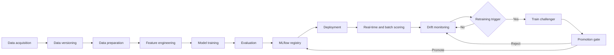

# IEEE-CIS Fraud Detection MLOps

A hands-on project for learning the complete machine-learning operations
(MLOps) lifecycle.

The goal of version 1 is not to find the perfect fraud-detection algorithm. It
is to understand how a model moves from data to a maintained, monitored service.
The current implementation uses LightGBM as the v1 model. Future versions can
replace or compare the model algorithm without changing the surrounding MLOps
workflow.

## Project status

| Item | Status |
| --- | --- |
| Project version | v1 |
| Learning focus | End-to-end MLOps lifecycle |
| Current model | LightGBM |
| Deployment style | Local Docker Compose |
| Future direction | Compare and improve ML algorithms |

## MLOps workflow

This project demonstrates the following closed loop:



### 1. Data acquisition and versioning

The dataset is obtained outside the repository and tracked with DVC. Raw data
files are kept out of Git, while DVC pointer files make the data dependency
reproducible.

**Dataset source:** [`IEEE-CIS Fraud Detection`](https://www.kaggle.com/competitions/ieee-fraud-detection/overview)

The current data represents online transactions and includes a binary
`isFraud` target. The data contains class imbalance, missing values, and a
temporal ordering that is useful for simulating production traffic.

### 2. Data preparation and feature engineering

The source tables are joined and transformed into processed feature files.
Feature preparation is kept separate from model serving so that the same
transformation is used consistently during training and inference.

The deployed model has a strict feature contract: exactly 218 input features,
including 9 categorical features with the expected dtypes. Invalid payloads
are rejected instead of being silently scored.

### 3. Training and evaluation

The current v1 model is a LightGBM classifier. The data is split chronologically
into:

- 70% training data
- 15% test data
- 15% production stream used to simulate unseen traffic

MLflow records training runs, parameters, metrics, and model artifacts. The
operating threshold is selected during evaluation and stored with the model.

### 4. Model registration

Models are packaged as MLflow `pyfunc` artifacts containing the feature
transformation, model, and operating threshold.

- **Champion**: the model currently served by the application.
- **Challenger**: a newly retrained model waiting for evaluation.
- **Promotion**: making a challenger the champion.

This keeps the model registry, the served artifact, and the prediction
interfaces aligned.

### 5. Deployment and serving

Docker Compose runs the local MLOps stack:

- MLflow provides experiment tracking and the model registry.
- FastAPI exposes the real-time prediction API.
- Prefect provides workflow orchestration and scheduling.
- A worker runs the stream simulator, monitoring, and retraining flows.

The API and worker share the same model store. When a challenger is promoted,
the API can serve the new champion without rebuilding or redeploying the
application.

The project supports two inference surfaces:

- **Real-time scoring**: score one transaction with `POST /predict`.
- **Batch scoring**: score a CSV and write results for monitoring.

### 6. Monitoring

The stream simulator replays the chronological production-stream slice through
the API. The monitoring flow batch-scores unseen chunks, stores the results, and
uses Evidently to compare the current window with the training reference.

Monitoring produces HTML and JSON drift reports and raises an alarm when the
configured drift rule is met.

### 7. Retraining and promotion

Retraining can be triggered by a drift alarm or by accumulated scored volume.
The retraining flow:

1. Collects historical data and transactions whose labels have been revealed.
2. Builds a new retraining corpus.
3. Trains a challenger model.
4. Evaluates the challenger against the champion.
5. Promotes the challenger only when the promotion gate is satisfied.

The simulated reveal lag models the fact that production labels are often
available after the original prediction, not at scoring time.

### 8. CI/CD

GitHub Actions validates every push and pull request with:

1. Locked dependency installation.
2. Ruff formatting and lint checks.
3. The model feature-contract check.
4. The pytest suite.
5. Docker Compose configuration validation.

After CI succeeds on the default branch, the serving image is built and
published to GitHub Container Registry.

## Technology stack

| Area | Technologies |
| --- | --- |
| Language | Python 3.12 |
| Dependency management | uv, `pyproject.toml`, `uv.lock` |
| Data processing | pandas, NumPy, PyArrow |
| Current ML algorithm | LightGBM |
| Alternative ML libraries | scikit-learn, XGBoost, CatBoost |
| Experiment tracking and registry | MLflow |
| Data versioning | DVC |
| Workflow orchestration | Prefect |
| Real-time serving | FastAPI, Uvicorn |
| Batch serving | Python CLI |
| Drift monitoring | Evidently |
| Containers | Docker, Docker Compose |
| CI/CD | GitHub Actions, GitHub Container Registry |
| Testing and quality | pytest, Ruff |
| Exploration and visualization | JupyterLab, Matplotlib, Seaborn |

## Quickstart

### Prerequisites

- Python 3.12
- [uv](https://docs.astral.sh/uv/)
- [Docker Desktop](https://www.docker.com/products/docker-desktop/) with at
  least 12 GB of memory allocated
- Access to the dataset and its DVC remote

### Install and prepare the project

```bash
uv sync
dvc pull
python -m ieee_cis_fraud_detection.features
```

The feature-generation command creates the processed files under
`data/processed/`. These generated files are intentionally not committed to
Git.

### Start the complete local stack

```bash
make demo
```

The stack provides:

| Service | URL | Purpose |
| --- | --- | --- |
| FastAPI | http://localhost:8000 | Real-time prediction API |
| MLflow | http://localhost:5001 | Experiments and model registry |
| Prefect | http://localhost:4200 | Flow scheduling and monitoring |
| Worker | No public URL | Simulator, monitoring, and retraining flows |

Useful commands:

```bash
make demo-logs       # follow service logs
make demo-down       # stop the Docker Compose stack
```

## MLOps commands without Docker

```bash
make data            # prepare the dataset
make seed            # create or refresh the v1 champion artifact
make simulate        # replay the production stream through the API
make monitor         # run one drift-monitoring pass
make retrain         # run one retraining and promotion pass
```

The demo alarms on drift but does not automatically retrain by default. To
enable automatic drift-to-retraining behavior:

```bash
MONITOR_TRIGGER_RETRAINING=true make demo
```

## Quality checks

```bash
make lint            # Ruff format and lint checks
make contract        # validate the model feature contract
make test            # run the test suite
```

Tests are designed to be hermetic and run without a network connection or a
fresh DVC pull when the committed seed artifact is available.

## Repository layout

```text
ieee_cis_fraud_detection/
├── modeling/        # splitting, thresholds, training, and model packaging
├── serving/         # FastAPI, batch scoring, and model loading
├── monitoring/      # drift detection and monitoring storage
├── orchestration/   # simulation, monitoring, and retraining flows
└── deployment/      # model seeding and feature-contract checks

data/                # DVC-tracked raw data and generated processed features
models/seed/         # committed v1 MLflow champion artifact
deploy/              # Dockerfile, Compose stack, and container scripts
notebooks/            # exploratory analysis and modeling notebooks
tests/                # automated tests
docs/                 # project documentation and architecture decisions
references/           # dataset and supporting references
```

## Version 1 limitations and future work

This project intentionally prioritizes understanding the MLOps lifecycle over
production-scale infrastructure. Planned improvements include:

- Comparing LightGBM with XGBoost, CatBoost, and other algorithms.
- Improving feature engineering and model calibration.
- Adding richer experiment-comparison dashboards.
- Adding production-grade metrics and observability.
- Evaluating cloud deployment options.
- Replacing the simulated stream and label reveal process with real data
  integrations.

The algorithm is expected to evolve. The reusable part of the project is the
workflow that makes each new model reproducible, testable, deployable,
monitorable, and replaceable.

## Related documentation

- [`deploy/README.md`](deploy/README.md) - detailed Docker deployment guide
- [`CONTEXT.md`](CONTEXT.md) - project vocabulary and lifecycle terminology
- [`docs/`](docs/) - documentation and architecture decisions
- [`references/data-description.md`](references/data-description.md) - current
  data description
