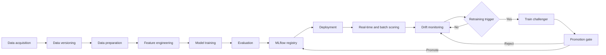

# IEEE-CIS Fraud Detection MLOps

> An end-to-end fraud-detection platform that demonstrates how a model moves
> from training to deployment, monitoring, and controlled retraining.

[](https://github.com/ovo4567/IEEE-CIS_Fraud_Detection_MLOp/actions/workflows/ci.yml)
[](https://www.python.org/)
[](deploy/README.md)

A hands-on project for learning the complete MLOps lifecycle with LightGBM,
MLflow, FastAPI, Prefect, Evidently, DVC, and Docker Compose. The goal is not
the perfect algorithm — it is understanding how a model moves from data to a
maintained, monitored service. The v1 model is LightGBM; future versions can
swap the algorithm without touching the MLOps workflow.

## Run the demo

```bash
python -m ieee_cis_fraud_detection.features   # one-time data setup (see Quickstart)
python scripts/dev.py demo                    # any OS — macOS/Linux: make demo
```

When the stack is up, open <http://localhost:8000/docs> and try `POST /predict`.
Service URLs are listed in [Quickstart](#quickstart).

> **Screenshot placeholder:** after running the demo, capture a dashboard
> screenshot, save it as `docs/figures/demo-dashboard.png`, and replace this
> note with ``.

## Project status

| Item | Status |
| --- | --- |
| Project version | v1 |
| Learning focus | End-to-end MLOps lifecycle |
| Current model | LightGBM |
| Deployment style | Local Docker Compose |
| Future direction | Compare and improve ML algorithms |

## MLOps workflow

This project demonstrates the following closed loop:



### 1. Data acquisition and versioning

The dataset is downloaded from Kaggle and tracked with DVC: raw files stay out
of Git, while DVC pointer files make the data dependency reproducible.

> **No DVC remote:** a fresh clone cannot `dvc pull`. Download the raw CSVs
> from Kaggle and place them in `data/raw/` (see Quickstart).

**Dataset source:** [`IEEE-CIS Fraud Detection`](https://www.kaggle.com/competitions/ieee-fraud-detection/overview)

The data contains a binary `isFraud` target, class imbalance, missing values,
and a temporal ordering useful for simulating production traffic.

### 2. Data preparation and feature engineering

The source tables are joined and transformed into processed feature files.
Feature preparation is kept separate from model serving so that the same
transformation is used consistently during training and inference.

The deployed model has a strict feature contract: exactly 218 input features,
including 9 categorical features with the expected dtypes. Invalid payloads
are rejected instead of being silently scored.

### 3. Training and evaluation

The v1 model is a LightGBM classifier, trained on a chronological 70/15/15 split
(training / test / simulated production stream). MLflow records runs, metrics,
and artifacts; the operating threshold is selected during evaluation and stored
with the model.

### 4. Model registration

Models are packaged as MLflow `pyfunc` artifacts containing the feature
transformation, model, and operating threshold.

- **Champion**: the model currently served by the application.
- **Challenger**: a newly retrained model waiting for evaluation.
- **Promotion**: making a challenger the champion.

This keeps the model registry, the served artifact, and the prediction
interfaces aligned.

### 5. Deployment and serving

Docker Compose runs MLflow (tracking and registry), FastAPI (real-time
prediction API), Prefect (orchestration), and a worker (simulator, monitoring,
and retraining flows). The API and worker share the same model store, so a
promoted challenger is served without rebuilding or redeploying.

Two inference surfaces are supported:

- **Real-time scoring**: score one transaction with `POST /predict`.
- **Batch scoring**: score a CSV and write results for monitoring.

### 6. Monitoring

The simulator replays the production-stream slice through the API. The
monitoring flow batch-scores unseen chunks and uses Evidently to compare the
current window with the training reference, producing HTML and JSON drift
reports and raising an alarm when the configured rule is met.

### 7. Retraining and promotion

Retraining is triggered by a drift alarm or accumulated scored volume. The flow
collects labeled historical data, trains a challenger, evaluates it against the
champion, and promotes it only when the promotion gate is satisfied. The
simulated reveal lag models the fact that production labels arrive after the
original prediction, not at scoring time.

### 8. CI/CD

GitHub Actions validates every push and pull request with:

1. Locked dependency installation.
2. Ruff formatting and lint checks.
3. The model feature-contract check.
4. The pytest suite.
5. Docker Compose configuration validation.

After CI succeeds on the default branch, the serving image is built and
published to GitHub Container Registry.

## Engineering highlights

- A strict 218-feature contract rejects invalid real-time payloads.
- A chronological 70/15/15 split separates training, evaluation, and simulated production traffic.
- MLflow keeps the registry and served champion model aligned through promotion.
- Evidently reports feature and score drift in the simulated production stream.
- Hermetic tests validate serving, monitoring, retraining, and deployment behavior.

## Technology stack

| Area | Technologies |
| --- | --- |
| Language | Python 3.12 |
| Dependency management | uv, `pyproject.toml`, `uv.lock` |
| Data processing | pandas, NumPy, PyArrow |
| Current ML algorithm | LightGBM |
| Alternative ML libraries | scikit-learn, XGBoost, CatBoost |
| Experiment tracking and registry | MLflow |
| Data versioning | DVC |
| Workflow orchestration | Prefect |
| Real-time serving | FastAPI, Uvicorn |
| Batch serving | Python CLI |
| Drift monitoring | Evidently |
| Containers | Docker, Docker Compose |
| CI/CD | GitHub Actions, GitHub Container Registry |
| Testing and quality | pytest, Ruff |
| Exploration and visualization | JupyterLab, Matplotlib, Seaborn |

## Quickstart

Prerequisites: Python 3.12, [uv](https://docs.astral.sh/uv/), and Docker Desktop
with ≥ 12 GB of memory. No training or `make` is needed: the v1 champion model
is committed, and every `make <name>` has a cross-platform equivalent
`python scripts/dev.py <name>`.

```bash
# 1. Install dependencies
uv sync

# 2. Add the Kaggle training tables (no DVC remote to pull from)
mkdir -p data/raw
cp path/to/train_transaction.csv path/to/train_identity.csv data/raw/

# 3. Build the processed features
python -m ieee_cis_fraud_detection.features

# 4. Start the stack
python scripts/dev.py demo
```

When the stack is up, open <http://localhost:8000/docs> and try `POST /predict`.

Only the two **training** tables are required — the test tables are used only
by the exploration notebooks. The committed seed model is used automatically,
so a fresh deployment needs no training. To follow logs or stop the stack:

```bash
python scripts/dev.py logs   # follow service logs (macOS/Linux: make demo-logs)
python scripts/dev.py down   # stop the stack      (macOS/Linux: make demo-down)
```

For Docker Compose configuration, resource requirements, environment variables,
and troubleshooting, see [`deploy/README.md`](deploy/README.md).

### Service URLs

| Service | URL | Purpose |
| --- | --- | --- |
| FastAPI | http://localhost:8000 | Real-time prediction API |
| MLflow | http://localhost:5001 | Experiments and model registry |
| Prefect | http://localhost:4200 | Flow scheduling and monitoring |
| Worker | No public URL | Simulator, monitoring, and retraining flows |

## MLOps commands without Docker

`make <name>` is equivalent to `python scripts/dev.py <name>` on any OS.

```bash
make data            # build processed features from the raw CSVs in data/raw
make seed            # create or refresh the v1 champion artifact
make simulate        # replay the production stream through the API
make monitor         # run one drift-monitoring pass
make retrain         # run one retraining and promotion pass
```

The demo alarms on drift but does not automatically retrain by default. To
enable automatic drift-to-retraining behavior:

```bash
MONITOR_TRIGGER_RETRAINING=true make demo      # macOS/Linux
# Windows (PowerShell):
# $env:MONITOR_TRIGGER_RETRAINING="true"; python scripts/dev.py demo
```

## Quality checks

```bash
make lint            # Ruff format and lint checks
make contract        # validate the model feature contract
make test            # run the test suite
```

These work without `make` too: `python scripts/dev.py lint | contract | test`.

Tests are designed to be hermetic and run without a network connection or the
raw dataset when the committed seed artifact is available.

## Repository layout

```text
ieee_cis_fraud_detection/
├── modeling/        # splitting, thresholds, training, and model packaging
├── serving/         # FastAPI, batch scoring, and model loading
├── monitoring/      # drift detection and monitoring storage
├── orchestration/   # simulation, monitoring, and retraining flows
└── deployment/      # model seeding and feature-contract checks

data/                # DVC-tracked raw data and generated processed features
models/seed/         # committed v1 MLflow champion artifact
deploy/              # Dockerfile, Compose stack, and container scripts
scripts/             # cross-platform task runner (python scripts/dev.py <name>)
notebooks/           # exploratory analysis and modeling notebooks
tests/               # automated tests
docs/                # project documentation and architecture decisions
references/          # dataset and supporting references
```

## Version 1 limitations and future work

This project intentionally prioritizes understanding the MLOps lifecycle over
production-scale infrastructure. Planned improvements include:

- Comparing LightGBM with XGBoost, CatBoost, and other algorithms.
- Improving feature engineering and model calibration.
- Adding richer experiment-comparison dashboards.
- Adding production-grade metrics and observability.
- Evaluating cloud deployment options.
- Replacing the simulated stream and label reveal process with real data
  integrations.

The algorithm is expected to evolve. The reusable part of the project is the
workflow that makes each new model reproducible, testable, deployable,
monitorable, and replaceable.

## Related documentation

- [`deploy/README.md`](deploy/README.md) - detailed Docker deployment guide
- [`CONTEXT.md`](CONTEXT.md) - project vocabulary and lifecycle terminology
- [`docs/`](docs/) - documentation and architecture decisions
- [`references/data-description.md`](references/data-description.md) - current
  data description
