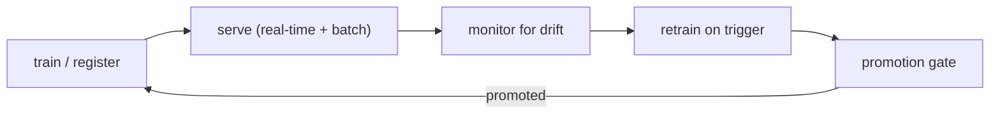

# Portfolio notes — the MLOps story

This page is the narrative for reviewers: what this project is, why the
decisions were made, and how the pieces fit into a real machine-learning
operations loop. It is deliberately not a how-to (that's `getting-started.md`
and [`deploy/README.md`](../../deploy/README.md)); it is the *story*.

## The problem

A strong fraud-detection model is not the same thing as a *deployable* fraud
detection system. The original repo had a fine-tuned LightGBM with a good
validation AUC, but no way to ship it: the model existed only as MLflow params,
there was no train → register → serve path, no monitoring, no retraining, and a
placeholder test suite. This project closes that gap end-to-end and keeps the
whole thing reproducible on a laptop.

The dataset (IEEE-CIS Fraud Detection, Kaggle) is a good stress test for an
MLOps pipeline, not just for modeling:

- **Extreme class imbalance** — fraud is a tiny fraction of ~590k transactions.
- **MNAR missingness** — missing values carry signal (e.g. 2.7× fraud lift when
  V2/V9 are absent), so naive imputation is actively wrong.
- **Time-ordered data** — `TransactionDT` is a timedelta, so evaluation must be
  chronological; the last slice can honestly stand in for unseen production
  traffic.

## The model

A fine-tuned LightGBM (randomized search, 5-fold `TimeSeriesSplit`) that
reaches **test AUC 0.9286** on the chronological 70/15/15 split and an
**operating threshold of 0.0551** chosen on the test set under a 10:1
missed-fraud : blocked-good cost ratio. The threshold is *stored with the
model* — serving never re-derives it.

Two modeling decisions worth defending:

- **Missingness-aware preprocessing** for the classical track (median fill +
  per-column `is_missing` indicators for numerics; `"missing"` as its own
  one-hot category for categoricals) instead of blind imputation — the 
  indicators carry the fraud signal.
- **Trees keep NaN native** — LightGBM/XGBoost consume the raw missingness;
  the deployed model's 218-feature transform is embedded in the artifact.

## The core design decisions (all recorded as ADRs)

1. **Local Docker only** (ADR-0001). The deployable artifact is a reproducible
   local Compose stack; GitHub's container registry is a *publish target*, not
   a runtime. A reviewer can run the entire system offline with one command.
2. **The artifact carries everything** (ADR-0002). The registered model is an
   MLflow `pyfunc` that embeds the feature transform, the booster, and the
   operating threshold. Serving surfaces are thin adapters — they never
   re-implement training logic, which is the classic source of train/serve skew.
3. **Chronological 70/15/15 split** (ADR-0003). Train / test / production
   stream. The test slice is reserved for threshold selection and
   champion-vs-challenger comparison; the stream slice is replayed to the
   serving stack label-free and becomes the "current" half of the drift window.
4. **Statistical promotion gate** (ADR-0004). A challenger is promoted only
   when a DeLong significance test on the shared test set shows it is genuinely
   better. This is what makes automated retraining safe rather than reckless.

## The closed loop, in three phases



**Serve.** Two surfaces share one model behind a strict **feature contract**
(exactly the 218 training columns, 9 categoricals as `category`): a FastAPI
`POST /predict` returning `{score, decision, threshold}` in real time, and a
batch CLI that scores CSVs. Malformed payloads are rejected with a precise
error — the API never silently scores a transaction that violates the contract.

**Monitor.** A Prefect flow batch-scores the next unseen chunk of the
production stream into a drift store, then an Evidently pass compares a recent
time-sliced window against the training reference (per-feature drift p-values +
score-distribution distance). The aggregate alarm rule — ≥10% of features drift
*or* the score distribution shifts — avoids single-feature noise. Reports are
saved as HTML + JSON for inspection.

**Retrain.** Two triggers start a retraining pass: a drift alarm or accumulated
scored volume since the last retrain (default ~5,000, configurable). The flow
rebuilds the corpus (all history + the scored stream whose labels have been
revealed after a 7-day reveal lag), trains a challenger on a fresh 70/15/15
re-split, and applies the DeLong gate. A promoted model is written into the
shared registry the API reads from — **promotion needs no redeploy**.

## What makes it a credible deployment (not a demo)

- **Reproducible from a fresh clone.** `make demo` pre-flights Docker, data,
  and the committed seed, then runs the whole stack offline. Verified
  end-to-end on empty volumes: MLflow seeds itself, the simulator POSTs the
  stream (200 OK), the drift store accumulates, the Evidently report is
  generated, and the alarm fires — with zero OOM and no surprise retrains.
- **Honest about label arrival.** The stream enters the stack label-free; the
  reveal lag models the real-world delay before a scored transaction's outcome
  is known. This is the detail that separates a real retraining loop from a
  toy.
- **A real promotion decision.** The DeLong gate was validated on synthetic
  data (stump champion vs. real forest — promotes reliably, p < 0.007 across
  seeds) and the challenger carries a version-unique artifact so the audit
  trail survives repeated retrains.
- **CI/CD that actually gates.** CI runs lint, the feature-contract check, the
  full test suite, and a Compose validation on every push; CD only publishes
  (to GHCR) what CI validated.
- **A serious test suite.** 151 hermetic tests across the scoring boundary,
  the API, batch, control-plane logic, retraining flows, drift monitoring, the
  store seeder, and the contract check — fast, no network, no data pull.

## What a reviewer should actually run

```bash
uv sync
# get the dataset from Kaggle first — copy the two train CSVs into data/raw/
make contract   # does the committed seed still carry the exact contract?
make test       # the full suite, offline
make demo       # the whole stack from the committed seed
```

Then open `http://localhost:8000` (score a transaction), `:5001` (MLflow
registry with champion v1), and `:4200` (Prefect scheduling the loop). The
drift report at `data/monitoring/reports/latest_drift_report.html` shows the
monitoring half of the loop live.

## Honest limitations & next steps

- The retraining flow uses MLflow *stages* (per ADR-0004 vocabulary) — MLflow
  3.x deprecates stages in favor of aliases; migrating is a future cleanup.
- Raw identity-feature join hurt AUC (only ~25% coverage, noisy high-cardinality
  categoricals) — engineered identity features, time features, and
  calibration are v2 ideas.
- Monitoring is Evidently reports + a drift threshold, not Prometheus/Grafana
  dashboards; retraining is triggered batch work, not online learning — both by
  design (see the spec's out-of-scope list).
